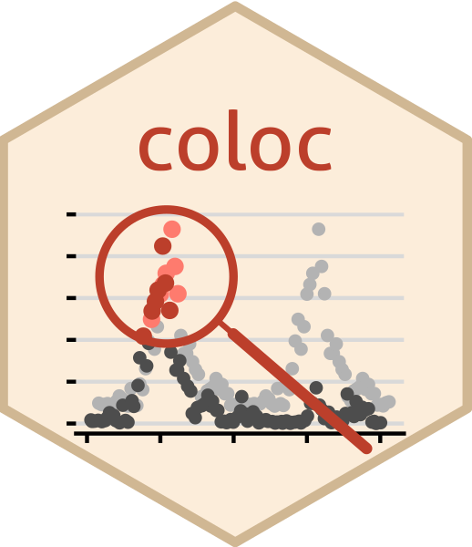

coloc
=====

[](https://travis-ci.org/chr1swallace/coloc)
[](https://cran.r-project.org/package=coloc)


The coloc package can be used to perform genetic colocalisation
analysis of two potentially related phenotypes, to ask whether they
share common genetic causal variant(s) in a given region. 

## susie branch

This is a development branch of coloc.  User beware!  If you get strange answers, it could be a bug in my code.  Please let me know, and send me enough information to try and track it down.  A working example with a slimmed down dataset is a great help.

This supercedes previously published version 4 by using the [SuSiE](https://stephenslab.github.io/susieR/index.html) approach to deal with multiple causal variants rather than conditioning or masking.  See 
> Wang, G., Sarkar, A., Carbonetto, P., & Stephens, M. (2020). A simple new approach to variable selection in regression, with application to genetic fine mapping. Journal of the Royal Statistical Society: Series B (Statistical Methodology). https://doi.org/10.1111/rssb.12388
for the full SuSiE paper.  

To install from R, do
```
if(!require("remotes"))
   install.packages("remotes") # if necessary
library(remotes)
install_github("chr1swallace/coloc","susie",build_vignettes=TRUE)
```

The function you want to look at is `coloc.susie`. It can take raw datasets, but the time consuming part is running SuSiE.  coloc runs SuSiE and saves a little extra information using the `runsusie` function before running an adapted colocalisation on the results.  So please look at the docs for `runsusie` too. I found a helpful recipe is
1. Run `runsusie` on dataset 1, storing the results
2. Run `runsusie` on dataset 2, storing the results
3. Run `coloc.susie` on the two outputs from above

More detail is available in the vignette a06_SuSiE.html accessible by

``` R
vignette("a06_SuSiE",package="coloc")
```

## version 4

This is an updated version of coloc.  I have tested it, but there may be bugs. Please test it, and let me know whether it works or not (both kinds of feedback useful!).  

It is not yet on CRAN. To install the new version, do
```
if(!require("remotes"))
   install.packages("remotes") # if necessary
library(remotes)
install_github("chr1swallace/coloc")
```


# Background

The new ideas are described in 
> [Wallace C (2020) Eliciting priors and relaxing the single causal variant assumption in colocalisation analyses. PLOS Genetics 16(4): e1008720](https://doi.org/10.1371/journal.pgen.1008720)

For usage, please see the vignette at https://chr1swallace.github.io/coloc

Key previous references are:
- original propostion of proportional colocalisation [Plagnol et al (2009)](http://www.ncbi.nlm.nih.gov/pubmed/19039033)
- proportional colocalisation with type 1 error rate control [Wallace et al (2013)](http://onlinelibrary.wiley.com/doi/10.1002/gepi.21765/abstract)
- colocalisation by enumerating all the possible causal SNP configurations between two traits, assuming at most one causal variant per trait [Giambartolomei et al (2013)](http://journals.plos.org/plosgenetics/article?id=10.1371/journal.pgen.1004383)

# Frequently Asked Questions

see [FAQ](FAQ.md)

# Notes to self

*to generate vignettes:*
```
cp vignettes/colocqq-tests.R.tospin vignettes/colocqq-tests.R && Rscript -e 'knitr::spin("vignettes/colocqq-tests.R",knit=FALSE); devtools::build_vignettes()'
```

*to generate website:*
https://chr1swallace.github.io/coloc/
```
Rscript -e "pkgdown::build_site()"
```
